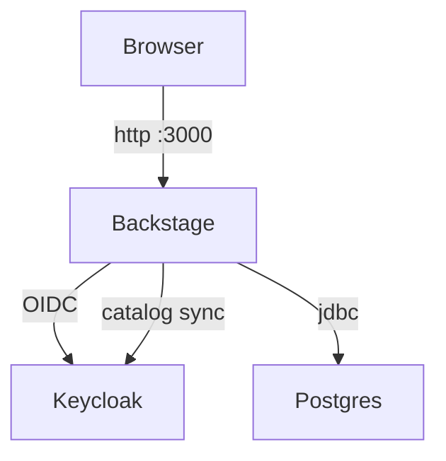

# homelab-backstage

A Backstage deployment for a homelab environment, demonstrating:

- **Keycloak** as identity provider (OIDC sign-in + catalog user/group sync)
- **PostgreSQL** as the catalog database
- Full **Docker Compose** stack for local development
- Production **multi-stage Dockerfile** + **GitHub Actions** CI/CD pipeline

> **Learning project** — code is heavily commented, favouring clarity over
> completeness.  See the "Known gaps" section at the bottom for what's stubbed.

---

## Architecture



| Service | Port | Purpose |
|---------|------|---------|
| Backstage backend | 7007 | API & plugin backends |
| Backstage frontend | 3000 | React UI (dev server) |
| Keycloak | 8080 | OIDC / IdP |
| PostgreSQL | 5432 | Backstage database |

---

## Running locally with Docker Compose

### Prerequisites

- Docker Engine ≥ 24 with Compose plugin
- `make` (optional, but convenient)

### Steps

```bash
# 1. Copy and configure environment variables
cp .env.example .env
# Edit .env and fill in secrets (at minimum BACKEND_SECRET, SESSION_SECRET,
# AUTH_OIDC_CLIENT_SECRET, KEYCLOAK_CATALOG_CLIENT_SECRET)

# 2. Start the full stack
make dev-up
# or: docker compose up -d

# 3. Wait ~60 s for all services to become healthy, then open:
#   Backstage:  http://localhost:3000
#   Keycloak:   http://localhost:8080  (admin / value from .env)
```

### Useful commands

```bash
make dev-logs                  # tail all logs
make dev-restart svc=backstage # restart a single service
make dev-down                  # stop (keep volumes)
make dev-clean                 # stop + remove volumes (full reset)
```

---

## Integrations

### Keycloak

See [docs/keycloak.md](docs/keycloak.md) for full details.

- The realm export at `keycloak/realm-export.json` is imported automatically
  on first Keycloak startup.
- Two demo users (`alice`, `bob`) are pre-created in the `platform-team` group.
- Sign-in uses the `backstage` OIDC client; catalog sync uses the
  `backstage-catalog-sync` service-account client.

Required env vars: `AUTH_OIDC_*`, `KEYCLOAK_*`

### Generic Webhooks

- Backstage exposes `POST/GET/... /api/webhooks/<app>/<event>`.
- Requests are forwarded to `${WEBHOOK_BASE_URL}/<tenant>/<app>/<event>`.
- Tenant defaults to `backstage-<auth.environment>` and can be overridden with
  `WEBHOOK_TENANT`.
- Method, query string, body, and headers are passed through for compatibility
  with external webhook backends.

---

## Production image pipeline

The root `Dockerfile` is a multi-stage build:

1. **build** stage — full Node 20, installs deps, runs `yarn tsc` and
   `yarn build:backend`.
2. **runtime** stage — slim Node 20 (`bookworm-slim`), non-root user, copies
   only the compiled backend bundle + frontend assets.

The GitHub Actions workflow `.github/workflows/build-image.yml`:

- Runs a **quality gate** (typecheck + tests) before building.
- Builds and pushes to **GitHub Container Registry** (`ghcr.io/<owner>/<repo>`).
- Tags with git SHA and (on version tags) semver.
- Uses **BuildKit layer caching** via `cache-from/cache-to: type=gha`.
- Runs a **Trivy** vulnerability scan on the pushed image (non-blocking).

A separate `.github/workflows/ci.yml` runs lint + typecheck + unit tests on
every pull request.

---

## Known gaps / next steps

| Area | Status | Notes |
|------|--------|-------|
| Keycloak prod TLS | ❌ Not done | Compose uses `start-dev`; production would need `start` + TLS certs |
| Permission policy | ❌ Stub | Uses `allow-all-policy`; replace with a real policy for production |
| TechDocs | ⚠️ Basic | Local builder, no external storage |
| Test coverage | ❌ Minimal | Scaffolded unit tests only |
| Kubernetes plugin | ⚠️ Enabled | No cluster connected; configure via `app-config.yaml` |
